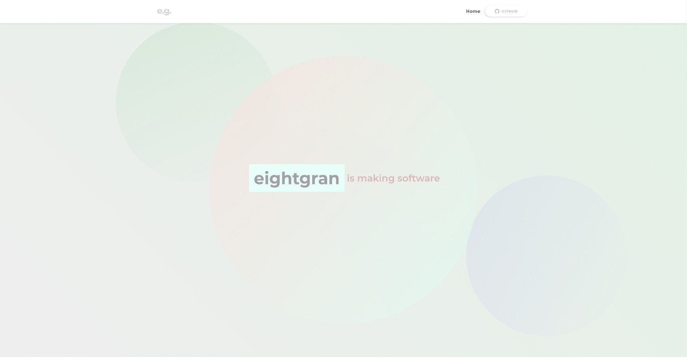

<p align="center">
  <a href="https://github.com/eightgran/website-gatsby">
    
  </a>
</p>

<h1 align="center">
  eightgran's personal website
</h1>

This is my personal website built with Gatsby and React.

## Screenshots

<p>Desktop View</p>
<p align="center">
    
</p>
<p>Mobile View with Custom Drawer</p>
    
    

## Dependencies

This website utilizes:

- [ReactJS](https://github.com/facebook/react/) as Javascript Framework.
- [Gatsby](https://github.com/gatsbyjs/gatsby) as Static Site Generator.
- [styled-components](https://github.com/styled-components/styled-components) for low-level styling of React components.

and Gatsby

## Quick start - Gatsby

1.  **Check out project**

    Use the git CLI to clone this project.

    ```bash
    git clone https://github.com/eightgran/website-gatsby.git
    ```

1.  **Start developing.**

    Navigate into your new site’s directory and start it up.

    ```bash
    cd website-gatsby/
    gatsby develop
    ```

1.  **Open the source code and start editing!**

    Your site is now running at `http://localhost:8000`!

    _Note: You'll also see a second link: _`http://localhost:8000/___graphql`_. This is a tool you can use to experiment with querying your data. Learn more about using this tool in the [Gatsby tutorial](https://www.gatsbyjs.com/tutorial/part-five/#introducing-graphiql)._

    Open the `my-default-starter` directory in your code editor of choice and edit `src/pages/index.js`. Save your changes and the browser will update in real time!

## Learning Gatsby

Looking for more guidance? Full documentation for Gatsby lives [on the website](https://www.gatsbyjs.com/). Here are some places to start:

- **For most developers, we recommend starting with our [in-depth tutorial for creating a site with Gatsby](https://www.gatsbyjs.com/tutorial/).** It starts with zero assumptions about your level of ability and walks through every step of the process.

- **To dive straight into code samples, head [to our documentation](https://www.gatsbyjs.com/docs/).** In particular, check out the _Guides_, _API Reference_, and _Advanced Tutorials_ sections in the sidebar.

## Credits

This website is made possible thanks to the [Gatsby Project](https://github.com/gatsbyjs) and the [React Community](https://github.com/reactjs).

## License

All the images in the `src/assets/images` folder are distributed under the **copyright** license. (_© 2015-2021 Michael Grigorenko. All rights reserved._)

Everything else in this repository including the source code is distributed under the
**BSD 3-Clause** license as specified in the `LICENSE` file.
